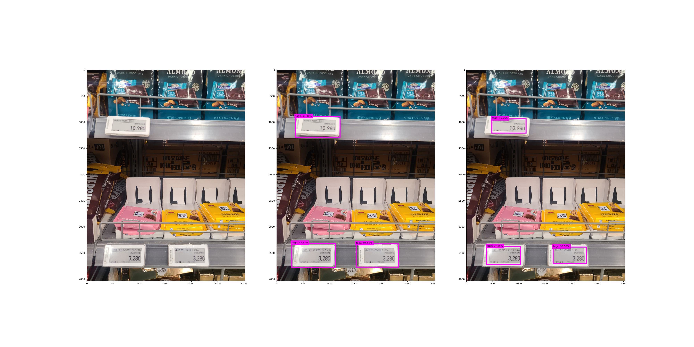
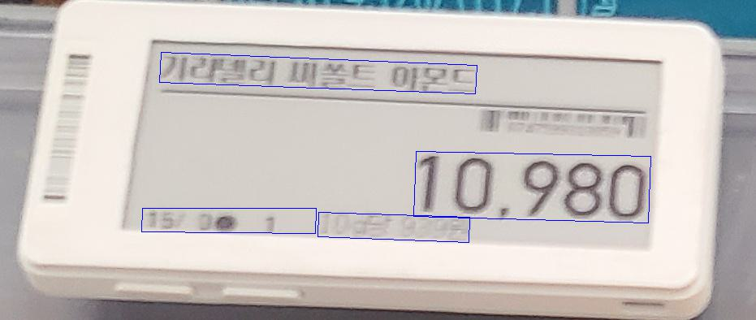
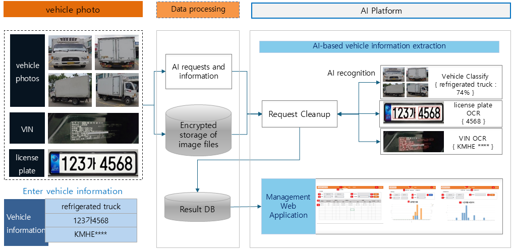
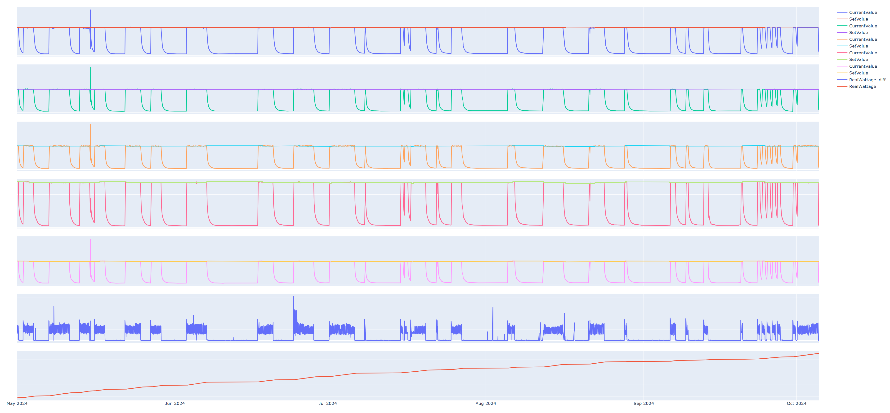
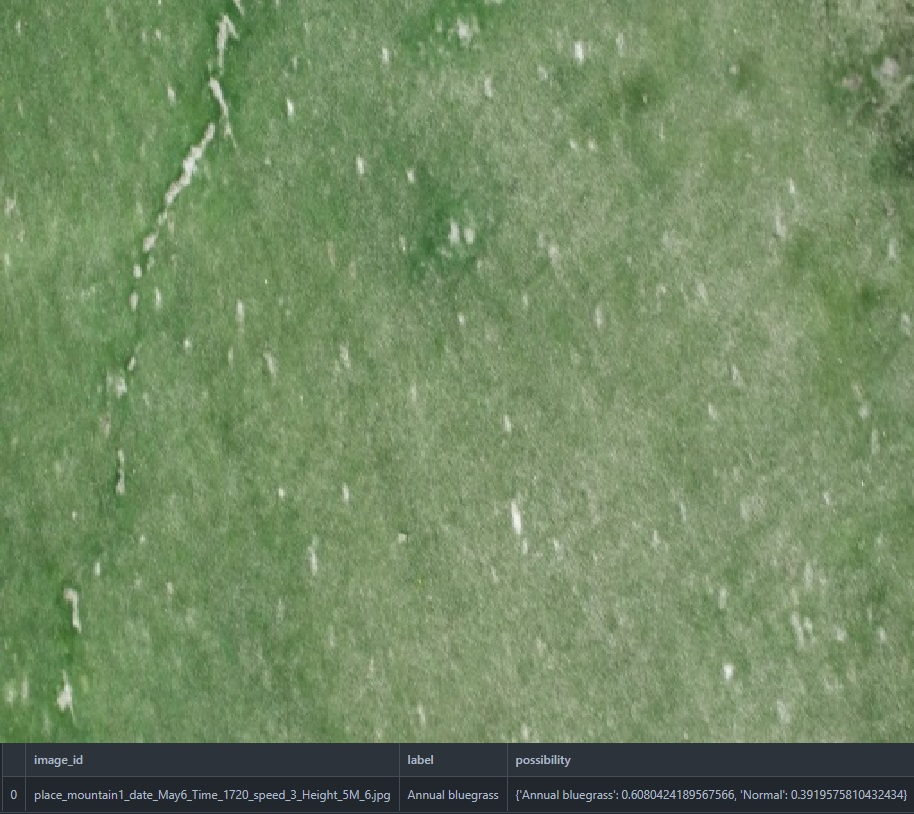
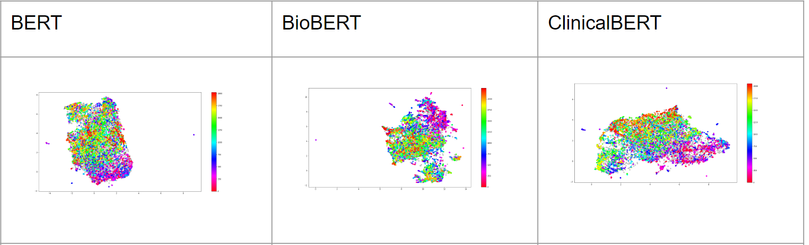
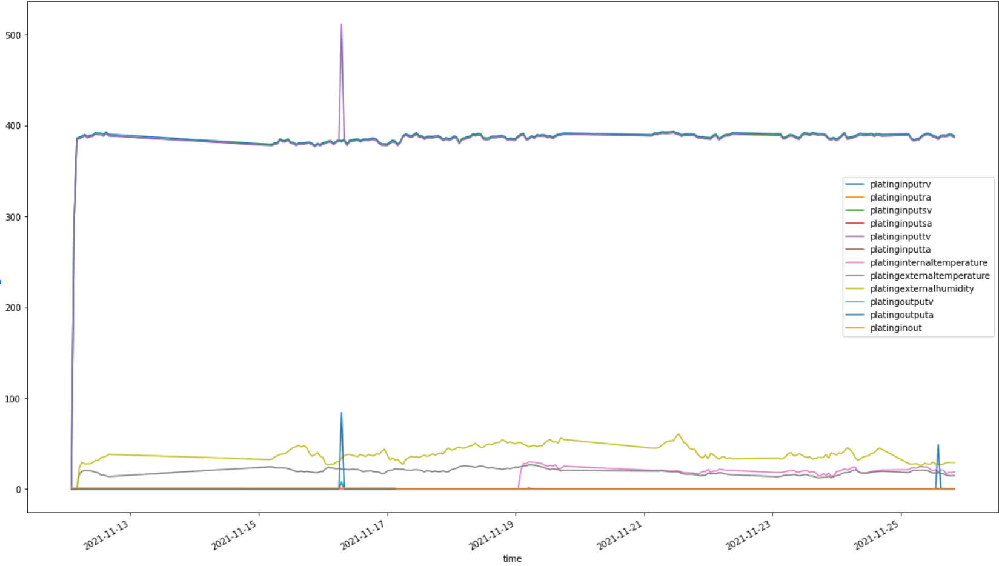

English | [한국어](./README_kr.md)

# AI Researcher Portfolio

An AI researcher with extensive experience in AI image processing and data analysis. I have successfully executed projects across various domains, including computer vision, natural language processing, and time-series data analysis.

---

## Work Experience

### **AITHENUTRIGENE**
*AI Researcher (April 2023 - Present)*

#### Key Responsibilities
- As a member of the AI Image Team, I was responsible for developing various computer vision models for classification, object detection, and OCR.

---

### Projects

#### 1. Azure OCR
*Period: April 2023 - July 2023*

<b>Project Details</b>

- **Objective:** To accurately extract information from in-store product price tags by capturing photos.
- **Key Achievements:**
  - Collected image data of price tags within stores.
  - Detected the location of price tags in images using **Azure Computer Vision (Object Detection)**.
  - Extracted text from within the price tags using **Azure OCR**.

---

#### 2. Shelf Object Detection
*Period: July 2023 - November 2023*

<b>Project Details</b>

- **Objective:** To detect and classify products on snack shelves in stores.
- **Key Achievements:**
  - Collected image data of snack shelves in stores.
  - Detected snack objects on the shelves using the **DINO model (detrex library)**.
  - Classified the detected objects to identify product names using the **ViT model (timm library)**.

---

#### 3. Commercial Vehicle Classification
*Period: November 2023 - August 2024*

<b>Project Details</b>

- **Objective:** To verify the consistency between photos of commercial vehicles and their entered information using AI.
- **Key Achievements:**
  - Collected 4 vehicle images (front, back, left, right) and 3 pieces of vehicle information (type, license plate, VIN) via an app.
  - Performed vehicle classification by comprehensively analyzing the four images using the **Swin-Transformer V2** model.
  - Applied a semi-supervised learning-based anomaly detection model.
  - Recognized text from license plates and Vehicle Identification Numbers (VIN) using **PaddleOCR**.

---

#### 4. Power Consumption Prediction for Automotive Parts Forging Lines
*Period: November 2023 - August 2024*

<b>Project Details</b>

- **Objective:** To develop a solution for predicting and reducing power consumption to improve energy efficiency in automotive parts forging lines.
- **Key Achievements:**
  - Collected and analyzed time-series data (power, temperature, etc.) from the forging lines.
  - Predicted future power consumption using **Time-Series Forecasting models**.
  - Identified energy-inefficient sections and proposed reduction measures based on the prediction model.

---

### **SPILAB**
*AI Researcher (July 2020 - November 2021)*

#### Key Responsibilities
- As a founding member of the startup, I collaborated with the CEO on project planning and coordination of external projects.
- Led and executed core development tasks.

---

### Projects

#### 1. Car Plate OCR

<b>Project Details</b>

- **Objective:** To automatically recognize the type and license plate of vehicles entering electric vehicle charging stations.
- **Key Achievements:**
  - Collected image data using a **Raspberry Pi 4**.
  - Generated synthetic electric vehicle license plate data using Image Augmentation techniques.
  - Developed a vehicle license plate detection model based on **YOLO v4 and v5**.
  - Developed an OCR model based on **Bidirectional LSTM**.
- **Link:** [https://github.com/forallx94/Electronic-Car-Generate](https://github.com/forallx94/Electronic-Car-Generate)

---

#### 2. Grass Disease Detection

<b>Project Details</b>

- **Objective:** To detect the condition of grass and the presence of diseases by analyzing drone-captured images of a golf course.
- **Key Achievements:**
  - Extracted image frames from drone-recorded videos.
  - Detected grass diseases using the **EfficientNet B5** model.
  - Managed and stored the analysis results in **MongoDB**.

---

#### 3. Cancer Clinical Trials Eligibility

<b>Project Details</b>

- **Objective:** To provide information on suitable clinical trials for new patients by leveraging cancer clinical trial data.
- **Key Achievements:**
  - Preprocessed and structured clinical trial data.
  - Performed text embedding using **TF-IDF, Word2Vec, and BERT**.
  - Conducted network analysis and clustering using **HDBSCAN and Hierarchical Clustering**.
  - Developed a core keyword extraction algorithm.

---

#### 4. Smart Factory IoT Unsupervised Anomaly Detection

<b>Project Details</b>

- **Objective:** To develop an unsupervised learning model that predicts anomalies in advance using IoT data from factory equipment.
- **Key Achievements:**
  - Retrieved data from factory compressors and rectifiers from **MySQL**.
  - Performed time-series data preprocessing and feature engineering.
  - Developed an unsupervised anomaly detection model using **Machine Learning, Prophet, and Autoencoder**.
- **Link:** [https://github.com/forallx94/Sequential_Anomaly_detecion](https://github.com/forallx94/Sequential_Anomaly_detecion)

---

#### 5. BAMS/HAMS Energy Consumption Forecast

<b>Project Details</b>

- **Objective:** To predict energy consumption in homes and buildings, including temperature, humidity, electricity usage, and hot water usage.
- **Key Achievements:**
  - Preprocessed energy consumption data for houses and buildings.
  - Developed an energy consumption forecasting model using **Prophet and Residual LSTM**.
  - Uploaded the prediction results to **MongoDB**.

---

### **HERSS**
*AI Researcher (March 2020 - June 2020)*

#### Key Responsibilities
- Responsible for preprocessing brain MRI data to improve the performance of a brain tumor detection model (U-Net).

---

### Project

#### 1. MRI Brain Tumor Segmentation

<b>Project Details</b>

- **Key Achievements:**
  - Applied and comparatively analyzed six preprocessing techniques, including Z-score normalization and White Stripe, on brain MRI data.
- **Insight:**
  - Despite various preprocessing methods, performance improvement was minimal. A comparative analysis with the original data was conducted.
  - The analysis revealed that the delivered data was not the original and had already undergone some preprocessing.
  - This experience highlighted the importance of data originality and the preprocessing pipeline, contributing to the improvement of the company's data handling processes.

