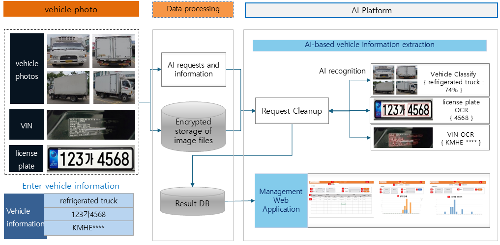
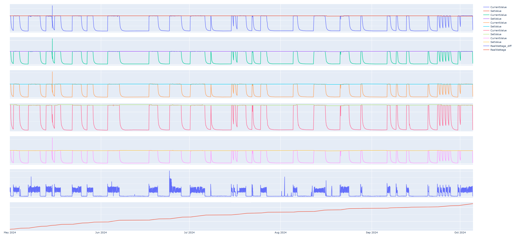

[English](./README.md) | 한국어

# AI Researcher Portfolio

AI 이미지 처리 및 데이터 분석 분야에서 다양한 경험을 쌓은 AI 연구원입니다. 컴퓨터 비전, 자연어 처리, 시계열 데이터 분석 등 여러 도메인에서 성공적인 프로젝트를 수행했습니다.

---

## 경력 (Work Experience)

### **AITHENUTRIGENE**
*AI Researcher (2023.04 - Present)*

#### Key Responsibilities
- AI 이미지 팀 소속으로 분류, 객체 탐지, OCR 등 다양한 컴퓨터 비전 모델 개발을 담당했습니다.

---

### Projects

#### 1. Azure OCR
*기간: 23.04 ~ 23.07*

<b>Project Details</b>

- **Objective:** 매장 내 상품 가격표를 촬영하여 정보를 정확하게 추출합니다.
- **Key Achievements:**
  - 매장 내 가격표 이미지 데이터 수집
  - **Azure Computer Vision (Object Detection)**을 활용하여 이미지 내 가격표 위치 탐지
  - **Azure OCR**을 통해 가격표 내 텍스트 정보 추출

---

#### 2. Shelf Object Detection
*기간: 23.07 ~ 23.11*

<b>Project Details</b>

- **Objective:** 매장 내 과자 진열대의 상품을 탐지하고 분류합니다.
- **Key Achievements:**
  - 매장 내 과자 진열대 이미지 데이터 수집
  - **DINO (detrex library)** 모델을 활용하여 진열대 내 과자 객체 탐지
  - **ViT (timm library)** 모델을 통해 탐지된 객체의 이미지를 분류하여 상품명 식별

---

#### 3. Commercial Vehicle Classification
*기간: 23.11 ~ 24.08*

<b>Project Details</b>

- **Objective:** 상업용 차량의 사진과 입력된 차량 정보의 일치 여부를 AI로 검증합니다.
- **Key Achievements:**
  - 앱을 통해 차량 이미지 4장(전, 후, 좌, 우)과 차량 정보 3종(차종, 번호판, 차대번호) 수집
  - **Swin-Transformer V2** 모델을 사용하여 4장의 이미지를 종합적으로 분석 및 차량 분류
  - 준지도학습(Slightly Unsupervised) 기반의 이상 탐지 모델 적용
  - **PaddleOCR**을 활용하여 차량 번호판 및 차대번호(VIN) 텍스트 인식

---

#### 4. Power Consumption Prediction for Automotive Parts Forging Lines
*기간: 23.11 ~ 25.12*

<b>Project Details</b>

- **Objective:** 자동차 부품 단조 라인의 에너지 효율성 개선을 위한 전력 소비량 예측 및 절감 솔루션을 개발합니다.
- **Key Achievements:**
  - 단조 라인에서 발생하는 시계열 데이터(전력, 온도 등) 수집 및 분석
  - **Time-Series Forecasting 모델**을 활용하여 미래 전력 소비량 예측
  - 예측 모델을 기반으로 에너지 비효율 구간을 탐지하고 절감 방안 제시

---

### **SPILAB**
*AI Researcher (2020.07 - 2021.11)*

#### Key Responsibilities
- 스타트업 초기 멤버로 CEO와 협력하여 프로젝트 기획 및 외부 과제 조율을 담당했습니다.
- 핵심 개발 업무를 리드하고 실행했습니다.

---

### Projects

#### 1. Car Plate OCR

<b>Project Details</b>

- **Objective:** 전기차 충전소에 진입하는 차량의 종류와 번호판을 자동으로 인식합니다.
- **Key Achievements:**
  - **Raspberry Pi 4**를 이용한 이미지 데이터 수집
  - Image Augmentation 기법을 활용한 전기차 번호판 데이터 생성
  - **YOLO v4, v5** 기반의 차량 번호판 탐지 모델 개발
  - **Bidirectional LSTM** 기반의 OCR 모델 개발
- **Link:** [https://github.com/forallx94/Electronic-Car-Generate](https://github.com/forallx94/Electronic-Car-Generate)

---

#### 2. Grass Disease Detection

<b>Project Details</b>

- **Objective:** 골프장에 드론으로 촬영한 이미지를 분석하여 잔디의 상태 및 질병 유무를 탐지합니다.
- **Key Achievements:**
  - 드론 촬영 영상에서 이미지를 프레임 단위로 추출
  - **EfficientNet B5** 모델을 활용한 잔디 질병 탐지
  - 분석 결과를 **MongoDB**에 업로드하여 관리

---

#### 3. Cancer Clinical Trials Eligibility

<b>Project Details</b>

- **Objective:** 암 임상시험 데이터를 활용하여 신규 환자에게 적합한 임상시험 정보를 제공합니다.
- **Key Achievements:**
  - 임상시험 데이터 전처리 및 정형화
  - **TF-IDF, Word2Vec, BERT**를 이용한 텍스트 임베딩
  - **HDBSCAN, Hierarchical Clustering**을 활용한 네트워크 분석 및 군집화
  - 핵심 키워드 추출 알고리즘 개발

---

#### 4. Smart Factory IoT Unsupervised Anomaly Detection

<b>Project Details</b>

- **Objective:** 공장 설비의 IoT 데이터를 활용하여 이상 징후를 사전에 예측하는 비지도학습 모델을 개발합니다.
- **Key Achievements:**
  - **MySQL**에서 공장 압축기, 정류기 데이터 호출
  - 시계열 데이터 전처리 및 특징 공학
  - **Machine Learning, Prophet, Autoencoder**를 활용한 비지도 이상 탐지 모델 개발
- **Link:** [https://github.com/forallx94/Sequential_Anomaly_detecion](https://github.com/forallx94/Sequential_Anomaly_detecion)

---

#### 5. BAMS/HAMS Energy Consumption Forecast

<b>Project Details</b>

- **Objective:** 주택 및 건물의 온도, 습도, 전기 사용량, 온수 사용량 등 에너지 소비를 예측합니다.
- **Key Achievements:**
  - 주택 및 건물 에너지 소비 데이터 전처리
  - **Prophet, Residual LSTM**을 활용한 에너지 소비량 예측 모델 개발
  - 예측 결과를 **MongoDB**에 업로드

---

### **HERSS**
*AI Researcher (2020.03 - 2020.06)*

#### Key Responsibilities
- 뇌종양 탐지(U-Net) 모델의 성능 향상을 위한 뇌 MRI 데이터 전처리를 담당했습니다.

---

### Project

#### 1. MRI Brain Tumor Segmentation

<b>Project Details</b>

- **Key Achievements:**
  - 뇌 MRI 데이터에 Z-score 정규화, White Stripe 등 6가지 전처리 기법 적용 및 성능 비교 분석
- **Insight:**
  - 다양한 전처리 기법에도 성능 개선이 미미하여 원본 데이터와 비교 분석을 수행했습니다.
  - 분석 결과, 전달받은 데이터가 원본이 아니며 이미 전처리가 일부 적용된 상태임을 발견했습니다.
  - 이 경험을 통해 데이터의 원본성과 전처리 과정의 중요성을 파악하고, 회사의 데이터 핸들링 프로세스를 개선하는 데 기여했습니다.

